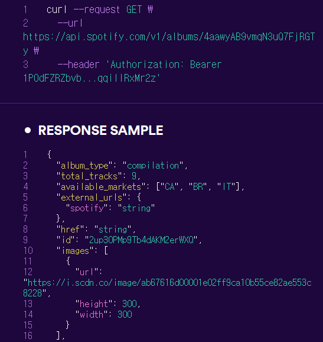
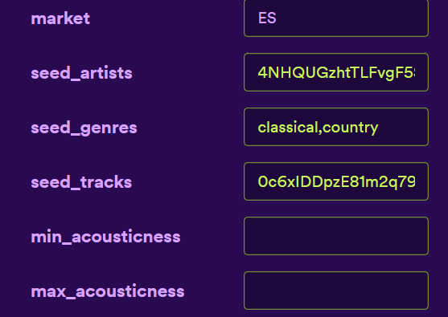
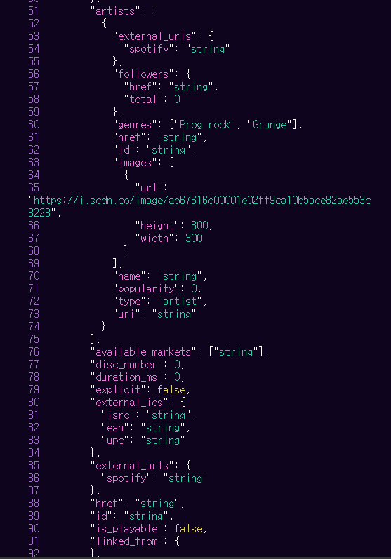
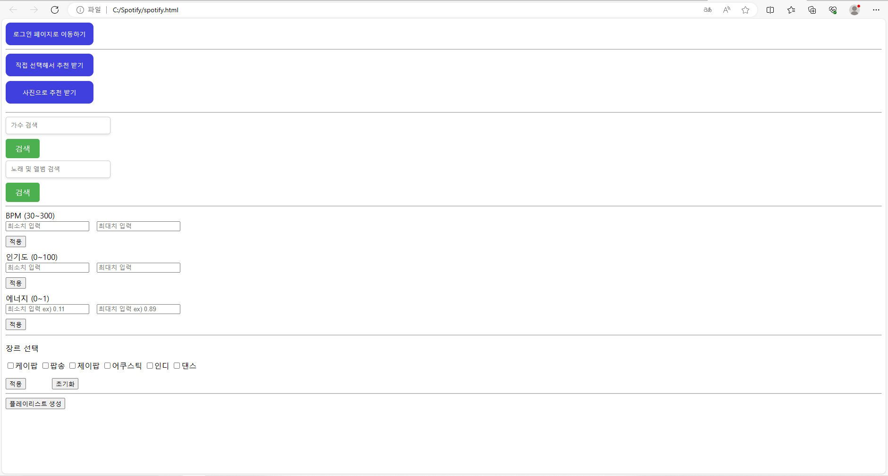

# ✔Music Explorer Project

## 1. 개요
 Music Explorer는 분위기, bpm, 에너지 등 사용자가 선호하는 구체적 요소를 반영해 음악 플레이리스트를 추천하는 서비스이다.
 
  음악의 발생 이후로 음악은 계속해서 축적되고 또 새로히 탄생하고 있다.
현대 기술이 발전하며 현재 우리는 전세계에서 축적된 방대한 양의 노래들을 쉽게 찾고, 들을 수 있게 되었다.

 다만 문제는 그렇게 축적되어 왔던, 또 축적되고 있는 음악의 절대적인 양이 너무나 방대하기 때문에 우리의 취향에 꼭 맞는 노래가 존재하더라도 그 존재조차 모르는 경우가 허다하다.

 그렇기에 이번 프로젝트에서는 사용자에게 구체적인 취향을 묻고, 그 취향에 꼭 맞는 새로운 플레이리스트를 추천해 드리고자 한다.

### 1-1. 프로젝트의 목표.
- 윗 내용의 문제를 해결하기 위해 여러 음악 스트리밍 사이트에서 다양한 음악추천 프로그램들을 만들어 왔다. 그럼에도 불구하고 메인스트림에 대한 큰 의존, 오버스펙트럼 등과 같은 단점은 명확한 것이 사실이다.
그래서 이 프로젝트에서는 구체성에 초점을 맞추어 개인이 선호하는 장르, 가수, 여러 세밀한 값들을 받아와 이를 토대로 한 노래 추천 프로그램을 짜보고자 한다.

## 2. 활용한 인공지능 API

### 2-1 Music Explorer 서비스에서 사용할 API

#### Spotify API
- Spotify Api는 Spotify사 에서 릴리즈한 api로  access Token을 발급하여 노래 데이터 분석, 사용자 데이터 분석 뿐만 아니라 여러 데이터를 조합해 플레이리스트를 생성하는 등 여러 작업을 수행 할 수 있다.

### 2-2 API의 입력과 출력
spotify api에서 토큰을 발급받아 아래의 예시처럼 여러 데이터 값을 받을 수 있으며 

 

여러 입력값을 토대로 

 

노래 추천 데이터 또한 받아올 수 있다. 

 

## 3. 웹페이지 구성
### 3-1 출력문

 #### 기본 화면
 
 

  
 

#### 플레이리스트 생성 화면

 

   

#### 사진기반 추천 플레이리스트

 

   

## 4. 실행결과

