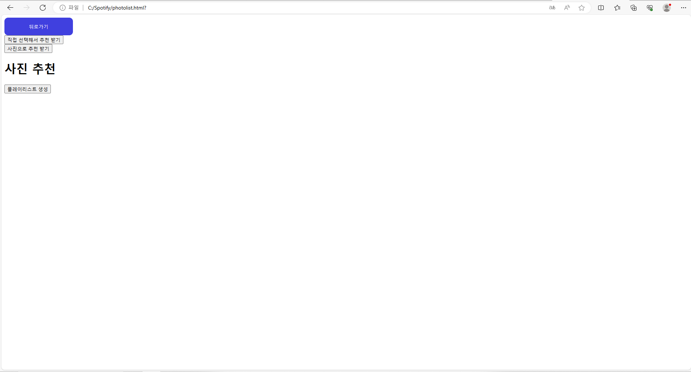
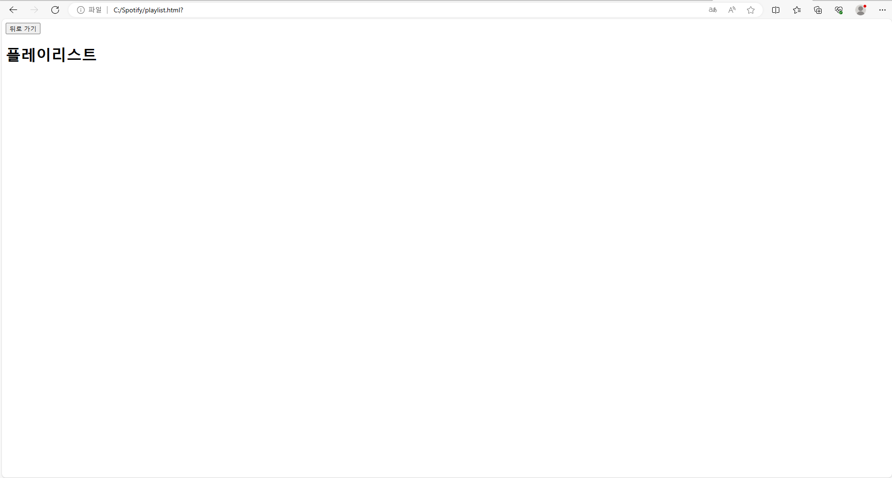

# Music Explorer

## 1. 개 요
***
 이번 프로젝트는 노래 추천 API와 노래 순위 계산 API를 활용해서 사용자 기반 노래 추천을 해보고자 한다.
음악 시장이 더욱 커져 가는 요즘 즐길 수 있는 다양한 음악 장르들이 생겨나면서 사람들이 선호 하는 음악의 종류가 우후죽순 생겨나고 있다.
이 프로젝트에서는 한 개인 마다의 기존 재생기록, 좋아요, 싫어요 등의 정보를 활용해 노래를 추천하고 이를 기반으로
슌위를 집계하는 서비스를 제공하자한다.

## 2. 활용한 인공지능 API
***
이번 프로젝트에서는 Google의 Google Cloud AI Music Recommendations API를 활용하고자 한다.
이 API를 활용함으로써 사용자의 선호도 데이터를 수집하여 이를 기반으로 사용자의 선호도 모델을 생성하고,
이를 토대로 순위를 정할 수 있다.

## 3. 웹페이지구축
***

## 4. 실행결과  
***

# Music Explorer (ME)

## 1. 개요
 음악시장이 더 커져 가는 요즘 다양한 노래들이 계속 만들어지며, 개인의 취향에 부합한 노래라 할 지라도 그 노래를 발견하지 못해 놓치는 경우가 빈번하다.
이번 프로젝트에서는 사용자가 마음에 드는 노래를 더 많이 찾을 수 있도록 개개인마다 입력값을..받아...플레이리스트를 생성하는 서비스를 제공하고자한다.
 

## 2. 활용한 인공지능 API
### 2.1 Music Explorer 서비스에서 사용할 API
Spotify API

### 2.2 API의 입력과 출력 
사용자 노래 추천의 기반이 되는 가수,장르,트랙등의 값 뿐만 아니라 BPM,energy,popularity 등의 세세한 값 또한 입력되어 플레이리스트를 생성해낸다.

## 3. 웹페이지 구축
### 3.1 출력문

### 3.2 추가내용

### 3.3 웹페이지 구성

## 4. 실행결과

